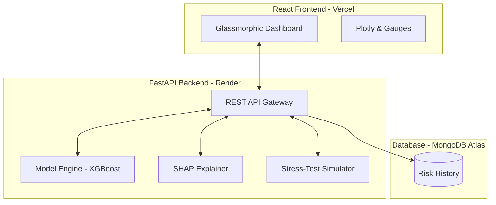

# Risk Navigator: Financial Risk Analysis & Prediction System 🛡️📊

A professional, full-stack risk management platform for **Credit Risk Assessment** and **Fraud Detection**. Built with high-performance machine learning models, explainable AI (XAI), and real-time MongoDB persistence.

---

### 🌐 Live Deployment
- **Dashboard**: [https://bda-financial-risk-system.vercel.app](https://bda-financial-risk-system.vercel.app)
- **API (FastAPI)**: [https://bda-financial-risk-api.onrender.com](https://bda-financial-risk-api.onrender.com)

---

## 🚀 Key Features

- **Credit Risk Engine** — XGBoost classifier predicting loan default probabilities based on real-world financial indicators (debt-to-income, credit history, etc.).
- **Hybrid Fraud Detection** — Dual-model approach combining an XGBoost classifier for known patterns and an Isolation Forest for novel anomaly detection.
- **Explainable AI (XAI)** — Integrated SHAP visualizations providing a "Why?" for every single risk score to meet regulatory transparency requirements.
- **Stress-Testing Simulator** — "What-If" scenario modeling (Market Crash, Recession, etc.) allowing users to stress-test arbitrary portfolios against macroeconomic shocks.
- **History Cockpit** — Dedicated persistence layer using MongoDB to log every prediction and monitoring system health.
- **Glassmorphic UI** — High-end React dashboard with custom CSS, interactive Gauges, and real-time performance metrics.

---

## 🏗️ Architecture



---

## 📂 Project Structure

```
├── frontend/                       # React (Vite) Application
│   ├── src/pages/                  # Dashboard, Credit, Fraud, History
│   ├── src/services/api.js         # API integration with Environment support
│   └── vercel.json                 # Vercel Deployment Configuration
├── src/                            # Backend Source
│   ├── api/main.py                 # FastAPI Gateway & Endpoints
│   ├── database.py                 # MongoDB Integration & Logging
│   ├── models/                     # ML Model Implementations
│   ├── preprocessing.py            # Feature Engineering & SMOTE
│   └── explainability.py           # SHAP Interpretation Engine
├── data/                           # Generated Training Datasets
├── models/                         # Serialized .pkl Binaries
├── render.yaml                     # Render Infrastructure-as-Code
└── requirements.txt                # Python Dependencies
```

---

## 🛠️ Local Setup & Core Workflow

### 1. Environment Preparation
Ensure you have Python 3.11+ and Node.js installed.
```bash
# Clone the repository
git clone https://github.com/ROHITH05012005/bda-financial-risk-system.git
cd bda-financial-risk-system

# Install Python dependencies
pip install -r requirements.txt
```

### 2. Model Training
Generate the synthetic data and train the predictive engines:
```bash
python train_models.py
```

### 3. Launch the System
```bash
# Start Backend
python -m src.api.main

# Start Frontend (in another terminal)
cd frontend
npm install
npm run dev
```

---

## 🛡️ Risk Methodology

### Scoring Thresholds
| Risk Level | Range (Probability) | Standard Response |
| :--- | :--- | :--- |
| **LOW** | 0 – 30% | Automated Approval |
| **MEDIUM** | 30 – 60% | Manual Underwriter Review |
| **HIGH** | 60 – 80% | Enhanced Due Diligence |
| **CRITICAL** | 80 – 100% | Immediate Escalation / Rejection |

### Model Performance
- **Credit Risk (XGBoost)**: ~0.95+ ROC-AUC
- **Fraud Detection (Hybrid)**: ~0.98+ ROC-AUC

---

## ☁️ Deployment Configuration

This project is configured for **Auto-Deployment**:
- **Backend (Render)**: Automatically triggers from GitHub pushes, runs `train_models.py` during build, and starts the uvicorn server.
- **Frontend (Vercel)**: Connects to the Render API via the `VITE_API_URL` environment variable.
- **Database (MongoDB Atlas)**: Provides global persistence for analytical auditing.

---

*This project was developed as a comprehensive Big Data Analytics (BDA) solution for modern fintech risk assessment.*
